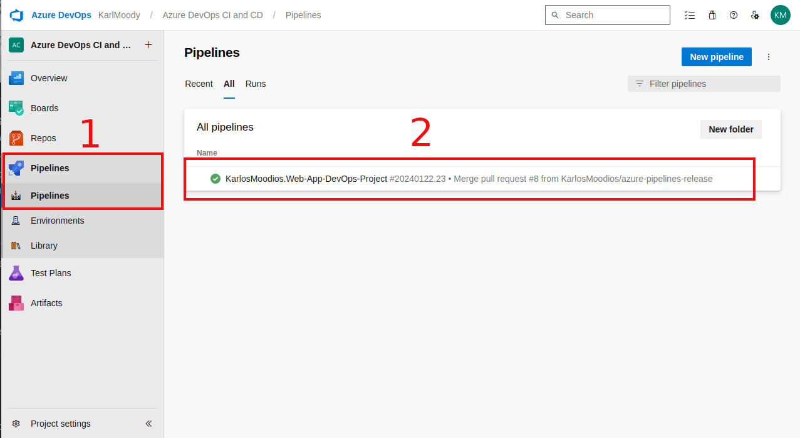

# Web-App-DevOps-Project

Welcome to the Web App DevOps Project repo! This application allows you to efficiently manage and track orders for a potential business. It provides an intuitive user interface for viewing existing orders and adding new ones.

## Table of Contents

- [Features](#features)
- [Getting Started](#getting-started)
- [Technology Stack](#technology-stack)
- [Contributors](#contributors)
- [License](#license)
- [Karl Moody Azure End-to-End DevOps Pipeline](#karl-moody-azure-end-to-end-devops-pipeline)
- [Milestone 1 - Set up the environment](#milestone-1---set-up-the-environment)
    - [Task 1 - Set up GitHub](#task-1---set-up-github)
    - [Task 2 - Set up Azure](#task-2---set-up-azure)
- [Milestone 2 - Version control](#milestone-2---version-control)
    - [Task 1 - Clone the forked repository](#task-1---clone-the-forked-repository)
    - [Task 2 - Create an Issue for the new column](#task-2---create-an-issue-for-the-new-column)
    - [Task 3 - Create features branch](#task-3---create-features-branch)
    - [Task 4 - Make code changes](#task-4---make-code-changes)
    - [Task 5 - Push changes to remote branch](#task-5---push-changes-to-remote-branch)
    - [Task 6 - Create pull request](#task-6---create-pull-request)
    - [Task 7 - Merge pull request](#task-7---merge-pull-request)
    - [Task 8 - Revert changes](#task-8---revert-changes)
- [Milestone 3 - Containerization with Docker](#milestone-3---containerization-with-docker)
    - [Task 1 - Build the Dockerfile](#task-1---build-the-dockerfile)
    - [Task 2 - Build the Docker image](#task-2---build-the-docker-image)
    - [Task 3 - Run the Docker container locally](#task-3---run-the-docker-container-locally)
    - [Task 4 - Tag and push the Docker image to DockerHub](#task-4---tag-and-push-the-docker-image-to-dockerhub)
    - [Task 5 - Confirm push was successful](#task-5---confirm-push-was-successful)
    - [Task 6 - Documentation and cleanup](#task-6---documentation-and-cleanup)
- [Milestone 4 - Defining network services with IaC](#milestone-4---defining-network-services-with-iac)
- [Milestone 5 - Defining an AKS Cluster with IaC](#milestone-5---defining-an-aks-cluster-with-iac)
- [Milestone 6 - Creating an AKS Cluster with IaC](#milestone-6---creating-an-aks-cluster-with-iac)
- [Milestone 7 - Kubernetes Deployment to AKS](#milestone-7---kubernetes-deployment-to-aks)
    - [Task 1 - Kubernetes manifest definition - Deployment](#task-1---kubernetes-manifest-definition---deployment)
    - [Task 2 - Kubernetes manifest definition - Service](#task-2---kubernetes-manifest-definition---service)
    - [Task 3 - Deploying Kubernetes manifests to AKS](#task-3---deploying-kubernetes-manifests-to-aks)
    - [Task 4 - Testing and validating deployments on AKS](#task-4---testing-and-validating-deployments-on-aks)
        - [Testing deployments](#testing-deployments)
        - [Validating deployments](#validating-deployments)
- [Milestone 8 - CI/CD Pipeline with Azure DevOps](#milestone-8---cicd-pipeline-with-azure-devops)
    - [Task 1 - Create an Azure DevOps Project](#task-1---create-an-azure-devops-project)
    - [Task 2 - Initiate Azure DevOps Pipeline Setup](#task-2---initiate-azure-devops-pipeline-setup)
    - [Task 3 - Establish an Azure DevOps-Docker Hub Connection](#task-3---establish-an-azure-devops-docker-hub-connection)
    - [Task 4 - Configure Pipeline for Docker Image Build and Push](#task-4---configure-pipeline-for-docker-image-build-and-push)
    - [Task 5 - Establish an Azure DevOps-AKS-Connection](#task-5---establish-an-azure-devops-aks-connection)
    - [Task 6 - Configure Pipeline for Kubernetes Deployment](#task-6---configure-pipeline-for-kubernetes-deployment)
    - [Task 7 - Testing and Validation of CI/CD Pipeline](#task-7---testing-and-validation-of-cicd-pipeline)
- [Milestone 9 - AKS Cluster Monitoring](#milestone-9---aks-cluster-monitoring)
- [Milestone 10 - AKS Integration with Azure Key Vault for Secrets Management](#milestone-10---aks-integration-with-azure-key-vault-for-secrets-management)
## Features

- **Order List:** View a comprehensive list of orders including details like date UUID, user ID, card number, store code, product code, product quantity, order date, and shipping date.
  

- **Pagination:** Easily navigate through multiple pages of orders using the built-in pagination feature.
  

- **Add New Order:** Fill out a user-friendly form to add new orders to the system with necessary information.
  

- **Data Validation:** Ensure data accuracy and completeness with required fields, date restrictions, and card number validation.

## Getting Started

### Prerequisites

For the application to succesfully run, you need to install the following packages:

- flask (version 2.2.2)
- pyodbc (version 4.0.39)
- SQLAlchemy (version 2.0.21)
- werkzeug (version 2.2.3)

### Usage

To run the application, you simply need to run the `app.py` script in this repository. Once the application starts you should be able to access it locally at `http://127.0.0.1:5000`. Here you will be meet with the following two pages:

1. **Order List Page:** Navigate to the "Order List" page to view all existing orders. Use the pagination controls to navigate between pages.

2. **Add New Order Page:** Click on the "Add New Order" tab to access the order form. Complete all required fields and ensure that your entries meet the specified criteria.

## Technology Stack

- **Backend:** Flask is used to build the backend of the application, handling routing, data processing, and interactions with the database.

- **Frontend:** The user interface is designed using HTML, CSS, and JavaScript to ensure a smooth and intuitive user experience.

- **Database:** The application employs an Azure SQL Database as its database system to store order-related data.

## Contributors 

- [Maya Iuga]([https://github.com/yourusername](https://github.com/maya-a-iuga))
- [Karl Moody]([https://github.com/yourusername](https://github.com/KarlosMoodios))

## License

This project is licensed under the MIT License. For more details, refer to the [LICENSE](LICENSE) file.

# Karl Moody Azure End-to-End DevOps Pipeline
## Milestone 1 - Set up the environment
### Task 1 - Set up GitHub
- Fork the repository, including all branches from https://github.com/maya-a-iuga/Web-App-DevOps-Project.
- Carefully read the README file to familiarise with the web application.
### Task 2 - Set up Azure
- Contact AICore support to receive login credentials for Microsoft Azure.
- Save the details in a file as these will be needed throughout the project.
## Milestone 2 - Version control
### Task 1 - Clone the forked repository
Use `git clone` to clone the repo from your repository on your gitHub account.
- `git clone https://github.com/<username>/Web-App-DevOps-Project.git`
### Task 2 - Create an Issue for the new column
- GitHub doesn't turn on issues by default. So navigate to the repository settings, in the general tab search for issues and check the box.
- On the same bar where the project settings button was found there will be an issues button near the far left of the navigation bar. Select that to view issues and at the top right select the green button 'New issue'.
- Create a new issue and assign it to the appropriate developer, tasking them to create a new column for the order tracking web application. The column will be for the creation of a delivery date within the order tracking web app.
### Task 3 - Create features branch
- Create a new branch on the local repository named `feature/add-delivery-date`.
- Use `git checkout -b feature/add-delivery-date` from the main branch. This will take you from the main branch, copy everything in the main branch and checkout to the new branch. The `-b` flag tells git to run `git branch` before `git checkout`
### Task 4 - Make code changes
- Make code changes to app.py and orders.html to reflect the new column across the web application.
- The changes needed to be made are in the following locations:
    - `app.py`:
        - The class definition for `Order`
        - The function definition for `add_order`
    - `orders.html`:
        - The `div class="tab-container"` needs a table header `th` and a table data `td` for delivery date, inside the `table class="order-table"`.
        - The `div class="content` needs a `label for` and an `input type` for delivery date.
### Task 5 - Push changes to remote branch
- Now the column has been added, push the changes to the remote origin. 
- `git push --set-upstream origin feature/add-delivery-date` will create a new branch on the remote repository on GitHub.
### Task 6 - Create pull request
- Create a pull request to pull the new features branch into the main branch on the forked repository to initiate proceedings to merge the two together.
### Task 7 - Merge pull request
- Review the changes to the code in the new branch
- If there are no conflicts merge them in 
- Delete the branch once its compeleted.
### Task 8 - Revert changes
- Create a new branch `called revert-deliver-date` while in the `main` branch.
- Use `git checkout -b revert-delivery-date`
- Use `git log` to find the commit hash of the change to revert.
- Use `git revert <commit-hash>` to undo the commit
- Push the changes to the remote branch using `git push --set-upstream origin revert-delivery-date`
- Create a pull request and merge the `revert-delivery-date` branch into `main` branch. Approve and merge the pull request.
## Milestone 3 - Containerization with Docker
### Task 1 - Build the Dockerfile
- Build the Dockerfile 
    - FROM - Use an official Python runtime `python:3.8-slim`
    - WORKDIR - Set the working directory in the container `/app`
    - COPY - Copy the application files into the container `. /app`
    - RUN - Install system dependencies and ODBC driver
    - RUN - Install pip and setuptools
    - RUN - Install python packages from the requirements.txt using `pip install --trusted-host pypi.python.org -r requirements.txt`
    - EXPOSE - expose port 5000 on local machine
    - CMD - Startup commands for container
### Task 2 - Build the Docker image
- Build the Dockerfile into a Docker image using `docker build -t <name of the image> .`
### Task 3 - Run the Docker container locally
- Use `docker run -d -p 5000:5000 <name of the image>`. The `-d` flag detaches the docker container from the CLI so you can still run docker commands, and `-p` publishes a list of all the containers ports to the host.
- Open a web browser and enter `http://127.0.0.1:5000` to access port 5000 on the local machine to interact with the web application in the container.
- Confirm the appliocation works as intended.
### Task 4 - Tag and push the Docker image to DockerHub
- Login to docker using the cli with `docker login`
- Use `docker tag <name of the image> <docker-hub-username>/<image-name>:<tag>` to tag the Docker image with the appropriate information.
- Then use `docker push <username>/<name of the image>:<tag>`
### Task 5 - Confirm push was successful
- Login to your Docker Hub account through a web browser to confirm that your docker image was successfully pushed to Docker Hub
- Stop the Docker container on your local system, using `docker stop <name>`. To see the list of all containers use `docker ps -a`. 
- Once stopped, get the Id or the name of the container to delete and then Use `docker rm <name>` or `docker rm <id>` to remove it completely.
- Pull the docker image from docker hub and test that it works as expected. Use `docker pull <username>/<name of the image>:<tag>`.
- Use `docker run -d -p 5000:5000 <username>/<name of the image>` to run the image from Docker Hub and check the image works the same.
- Stop the container and remove the container. 
### Task 6 - Documentation and cleanup
- Delete any containers created during these tasks using the methods in task 5.
- Remove both images from your system using `docker rmi <image id>`. To see a list of images use `docker images`.
## Milestone 4 - Defining network services with IaC
- See `README.md` and `definitions.md` in the `aks-terraform` directory.
## Milestone 5 - Defining an AKS Cluster with IaC
- See `README.md` and `definitions.md` in the `aks-terraform` directory.
## Milestone 6 - Creating an AKS Cluster with IaC
- See `README.md` and `definitions.md` in the `aks-terraform` directory.
## Milestone 7 - Kubernetes Deployment to AKS
### Task 1 - Kubernetes manifest definition - Deployment
- Create `application-manifest.yaml` and create a Deployment including `apiVersion`, `kind`, `metadata` and `spec`
- Set the values of `apiVersion`, `kind` and `metadata` to `apps/v1`, `Deployment` and `name: flask-app-deployment` respectively.
- In `spec`: 
    - specify 2 replicas. 
    - In the `selector` and `template` fields, use the `matchLabels` field to define a label that uniquely identifies the application. In this instance `app: flask-app` has been used.
    - Configure the manifest to point to the specific container housing the application. In this instance, `name` is set to `order-tracking` and the `image` is set to `karlosmoodios/order-tracking`
    - `resources` - Set a resource limit for `memory` at `512Mi` and `cpu` to `1`
    - Expose port `5000` for communication withing the AKS Cluster
    - Implement the `rollingUpdates` strategy to facilitate seamless application updates. while configuring, ensure that `maxSurge` and `maxUnavailable` are both set to `1`. 
### Task 2 - Kubernetes manifest definition - Service
- Add a Service to the `application-manifest.yaml` file. To seperate a Deployment and Service definition in the same document, use `---`.
- Create the fields `apiVersion`, `kind`, `metadata` and `spec` 
- Set the values of `apiVersion`, `kind`, `metadata` to `v1`, `Service`, `name: flask-app-service` respectively.
- in spec:
    - Set the `type` to `ClusterIP`. ClusterIP is great for internal communications that don't need exposure to the outside world.
    - Set the field `selector:` with the field `app:` to `flask-app`. This guarantees that traffic is efficiently directed to the correct pods when internal ccommunication happens within the cluster.
    - Configure the `ports` field, setting the `protocol` to `TCP`, and the `port` to `80` for internal communications between nodes. Additionally, set the targetPort to 5000 which exposes the same port as the container. This will enable connection to the application on the cluster from the local machine.
### Task 3 - Deploying Kubernetes manifests to AKS
- `kubectl config get-contexts` will show a list of the contexts/clusters available. If the current context is not the AKS cluster, use `kubectl config set-context <name_of_cluster>` to change into the correct one to ensure the deployment is done in the intended environment.
- Now use `kubectl apply -f application-manifest.yaml` to apply the application.
- Confirm that the pods and services were correctly deployed using `kubectl get pods` and `kubectl get services`. 

### Task 4 - Testing and validating deployments on AKS
#### Testing deployments
- If correctly deployed You will see something like the following images for each command:
    - `kubectl get pods`:   
    - `kubectl get services`:   
- To test the situation "if a pod goes down" and that another one will be created use `kubectl delete pod <name_of_pod>` It will delete the pod with that name and then create another in its place. 
#### Validating Deployments
- Verify the health and status of the pods and services.
- Run `kubectl port-forward <pod-name> 5000:5000` to establish a connection to your the desired pod on the local machine. This will enable access to the application through the local host at port 5000.
- Open a web browser and enter into the URL field: `http://127.0.0.1:5000`
- Orders list:   
- Add new order:   
- Updated orders list:   
## Milestone 8 - CI/CD Pipeline with Azure DevOps
### Task 1 - Create an Azure DevOps Project
- Login to Azure DevOps with AICore credentials
- Create an Azure DevOps Project  
- Enter the name desired for the project.  
- Confirm and create the project.   
### Task 2 - Initiate Azure DevOps Pipeline Setup
- Select `Pipelines` from the left navigation pane and then select `New pipeline`. 
- Choose where to store or find your code, in this instance, select GitHub.  
- Select a repository to link to the pipeline. 
- Configure the pipeline to be a starter pipeline.  
- Click save and run to save the pipeline as `azure--pipelines.yml`. 
### Task 3 - Establish an Azure DevOps-Docker Hub Connection
- Sign in to the Docker Hub account where the order-tracking image is stored. In the top right corner of the content, click on the logo resembling the account to reveal a dropdown menu and select `My Account`.  
- On the left navigation pane, select `Security` and then select `New Access Token`.  
- Enter the `name` of the token, select the `access permissions` desired for the token and click `Generate`.  
- The token will generate __ONLY ONCE!__ Make sure to copy this token and store it somewhere for the rest of this task. Once its used it can be deleted. 
- Go to the Azure Devops Project and select `Project settings` at the bottom left of the window. 
- In the settings, navigate to the left hand panel and select `Service connections`. Then select `New service connection` at the top right.  
- In the window that opens, type `Docker` in the search field and select `Docker Registry`. Click `Next`. 
- In the fields, enter the DockerID, password and assign the service connection a name. The password should be filled with the Personal Access Token generated from Docker earlier.    Click save. There is now a service connection between Azure DevOps and Docker Hub.
### Task 4 - Configure Pipeline for Docker Image Build and Push
- Access the homepage of the DevOps organisation and click `Organisation settings` at the bottom left of the window.  
- Select billing from the left hand navigation and then click `Set up billing`. 
- In the setup, choose the account to manage the billing as the Azure subcription managed by AICore and click save. This grants access to compute resources.
- With billing set up, set the number of MS Hosted CI/CD paid parallel jobs to 2. 

- Navigate to the pipeline where `azure-pipelines.yml` is saved.  
- `trigger` is set to `main` so that whenever the main branch is updated it will run this pipeline.
- Edit and remove the default config in the `steps` section. 
- In the search tasks field on the type `docker` and select `Docker`.  
    - In `Container registry`, select the service connection `Docker Hub`.
    - In `Container repository`, enter the `<username>/<imagename>` of the Docker Hub repository.
    - In `Command`, if not already selected, choose `BuildAndPush`.
    - In `Tags`, replace the default entry with `latest`. This will ensure the latest version of the image is run whenever main is updated at the source repository.
    - Any fields not mentioned should stay as they are such as:
        - Dockerfile: Which is by default set to look at the root directory for a Dockerfile; where it should be stored.
- Once everything is entered correctly, Click `Add`.  
- There is now a new section entered into steps which reflects the data that was entered. Click `Save`. 
    - When saving, a commit will be made and pushed to the working branch of the repository on GitHub.
- To run the pipeline, navigate to the pipeline and click run in the top right hand cornver of the window.  
- As the job starts, its possible there are insuffiecient permissions and a warning message may appear. Click `View` and `Permit` accordingly and the job should start. 
- The job can be viewed in real-time by clicking on `Job`.  
- When the job is complete it will look like this:  
- Finally, navigate to Docker Hub to confirm the image was pushed to the repository.  

### Task 5 - Establish an Azure DevOps-AKS-Connection
- As before with Azure-Docker service connection, create a new service connection by going to `Project settings` -> `Service connections.` Click `New service connection` and search for `Azure resource manager`. 
- Select `Workload Identity ferderation (automatic)` and click `Next`.  
- Select the desired subscription to link to Azure DevOps. 
    - When doing so a prompt will pop up asking for verification of the Microsoft account assosciated with the subscription for security purposes. If the window is closed before verifying, the process must be restarted.     Once verified, the subscription will be accessible by the following step.
- Open the drop down menu and select the resource group associated with where the virtual network (AKS cluster) is stored. In this instance, `networking_resource_group`.   
- Give the service connection a name and click `Save`.  
- Once saved the Service connections should look like this:    Now everything is set up for Azure DevOps and the AKS Cluster to communicate seamlessly.

### Task 6 - Configure Pipeline for Kubernetes Deployment
- Go to the pipeline, and click `Edit`.  
- In the search panel on the right hand side, search for `Deploy to Kubernetes`. This task will enable `kubectl` commands inside of the AKS Cluster.   Select `Deploy to Kubernetes`.
    - Action type: `deploy`
    - Service connection type: `Azure Resources Manager`
    - Azure subscription: `Azure-AKSCluster`
    - Resource group: `networking_resource_group`
    - Kubernetes cluster: `terraform_aks_cluster`
    - Manifest path: `./application-manifest.yaml`
-    
Once everything is entered correctly, click `Add`.
- Click `Save` In the top right of the window and the azure-pipelines.yml should now look like this:   The Outline area is the code that was added to the file. It is responsible for deploying any updates continuously to the cluster.

### Task 7 - Testing and Validation of CI/CD Pipeline
- Click on `Run` in the top right of the window to test the pipeline to ensure that everything works as expected.  
- A menu will open, here, specify the `main` branch to run from. It is possible to run from a specific commit hash but in this case it will be left blank. Click `Run`.  
- Once the job is queued, monitor its progress in real-time to ensure everything is working as expected with deployment.  
- A screenshot of the Docker Image being built.  
- Job posting of the completion of deployment to the AKS Cluster.  
- Open a terminal and type `kubectl get pods`. 
- Then type `kubectl port-forward <name_of_pod> 5000:5000`  
- Open a web browser and go to `127.0.0.1:5000` to view the web app on the AKS Cluster. Test the functionality of the web app, click on `Add New Order`.  
- Enter relevant data in each field and make a note of what was entered to search for it after clicking add order. Click `Add Order`.  
- Use the `Next` page button and search for the updated order entry in the list.  

## Milestone 9 - AKS Cluster Monitoring
- The cluster can be monitored on the azure portal. In the following image, it is possible to see the activity spiked in `Node pool CPU (max)`, `Node pool network in (max)` and `Node pool network out (max)`, all roughly at the same time.   At a glance this indicates the cluster is working well and is healthy, however, it doesn't offer any in-depth information. 
- To enable `Container Insights`, go to `terraform_aks_cluster` in the azure portal:  `Home` > `All resources` > `terraform_aks_cluster`.  
- On the left navigation pane scroll down to and select `Insights`.     Then select `Configure monitoring`.
- A window will open that looks like this:    Select configure at the bottom left. Set up may take a few minutes.
- Once enabled it's possible to view the status of the cluster, including `Node CPU Utilisation`, `Node Memory Utilisation`, `Node Count` and an `Active Pod Count`, over a time range of the last 6 hours.  
- This can also be viewed in real-time updates (live) as per the following image.  

## Milestone 10 - AKS Integration with Azure Key Vault for Secrets Management
