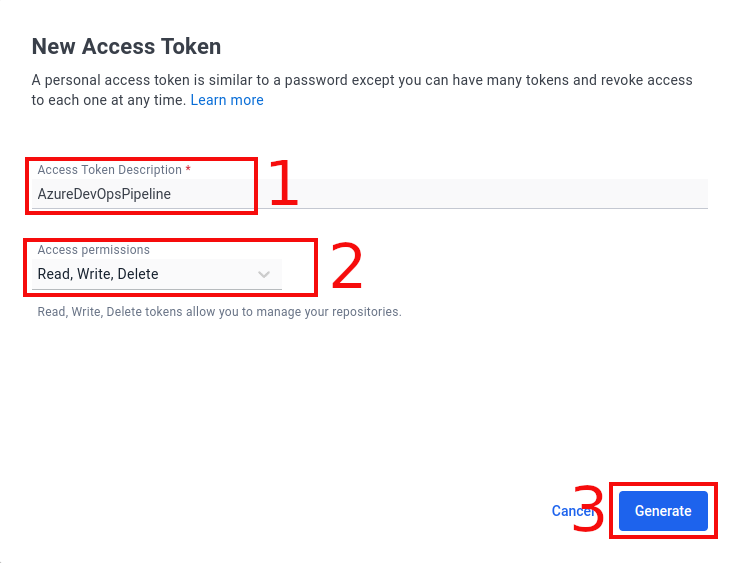
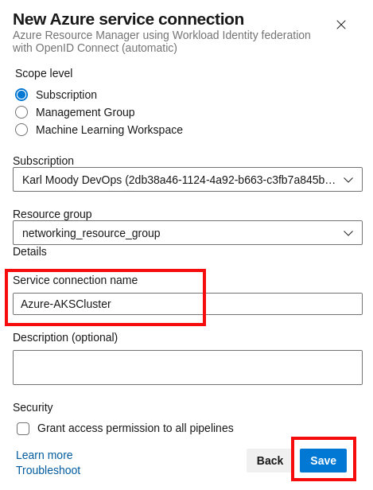
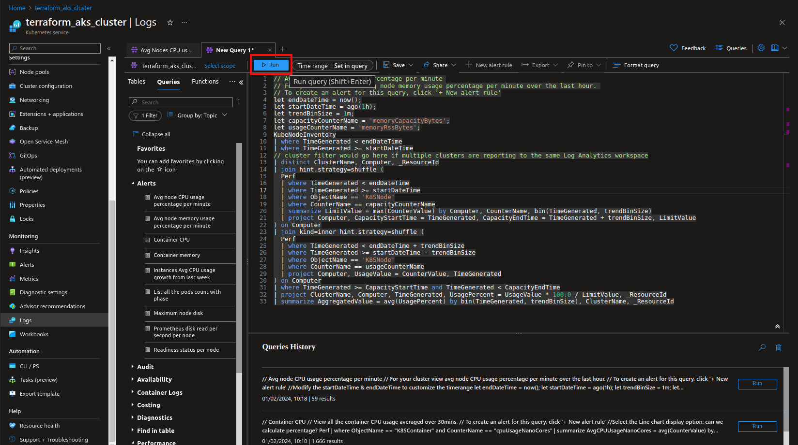
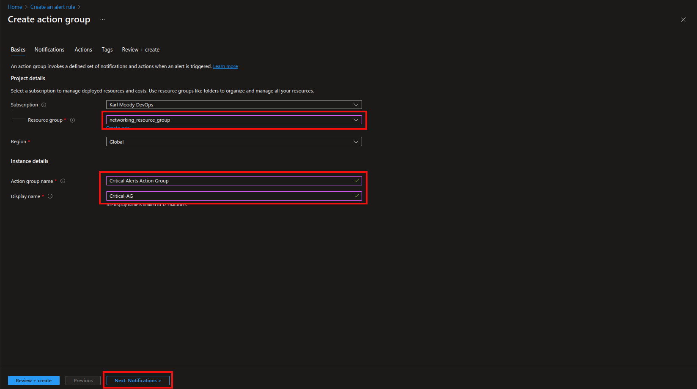
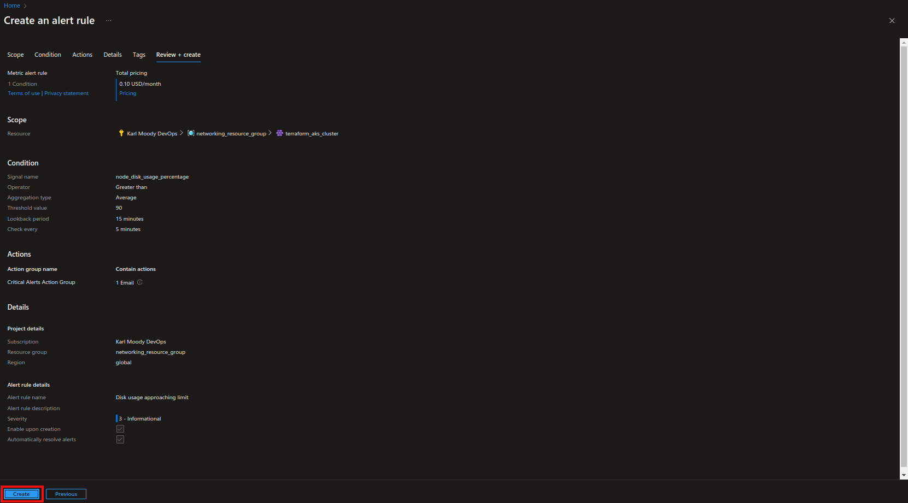

# Web-App-DevOps-Project

Welcome to the Web App DevOps Project repo! This application allows you to efficiently manage and track orders for a potential business. It provides an intuitive user interface for viewing existing orders and adding new ones.

## Table of Contents

- [Features](#features)
- [Getting Started](#getting-started)
- [Technology Stack](#technology-stack)
- [Set up the environment](#set-up-the-environment)
- [Version control](#version-control)
- [Containerization with Docker](#containerization-with-docker)
- [Defining network services with IaC](#defining-network-services-with-iac)
- [Defining an AKS Cluster with IaC](#defining-an-aks-cluster-with-iac)
- [Creating an AKS Cluster with IaC](#creating-an-aks-cluster-with-iac)
- [Kubernetes Deployment to AKS](#kubernetes-deployment-to-aks)
- [CI/CD Pipeline with Azure DevOps](#cicd-pipeline-with-azure-devops)
- [AKS Cluster Monitoring](#aks-cluster-monitoring)
- [AKS Integration with Azure Key Vault for Secrets Management](#aks-integration-with-azure-key-vault-for-secrets-management)
- [Contributors](#contributors)
- [License](#license)
    
## Features

**Order List:** View a comprehensive list of orders including details like date UUID, user ID, card number, store code, product code, product quantity, order date, and shipping date.
-   

    
Order List

    
    

**Pagination:** Easily navigate through multiple pages of orders using the built-in pagination feature.
-   

    
Pagination

    
    

**Add New Order:** Fill out a user-friendly form to add new orders to the system with necessary information. 
-   

    
Add New Order

    
    

**Data Validation:** Ensure data accuracy and completeness with required fields, date restrictions, and card number validation.

## Getting Started

### Prerequisites

For the application to succesfully run, you need to install the following packages:

- flask (version 2.2.2)
- pyodbc (version 4.0.39)
- SQLAlchemy (version 2.0.21)
- werkzeug (version 2.2.3)

### Usage

To run the application, you simply need to run the `app.py` script in this repository. Once the application starts you should be able to access it locally at `http://127.0.0.1:5000`. Here you will be meet with the following two pages:

1. **Order List Page:** Navigate to the "Order List" page to view all existing orders. Use the pagination controls to navigate between pages.

2. **Add New Order Page:** Click on the "Add New Order" tab to access the order form. Complete all required fields and ensure that your entries meet the specified criteria.

## Technology Stack

- **Backend:** Flask is used to build the backend of the application, handling routing, data processing, and interactions with the database.

- **Frontend:** The user interface is designed using HTML, CSS, and JavaScript to ensure a smooth and intuitive user experience.

- **Database:** The application employs an Azure SQL Database as its database system to store order-related data.

## Set up the environment
Description

Step-by-step guide

### Task 1 - Set up GitHub
- Fork the repository, including all branches from https://github.com/maya-a-iuga/Web-App-DevOps-Project.
- Carefully read the README file to familiarise with the web application.
### Task 2 - Set up Azure
- Contact AICore support to receive login credentials for Microsoft Azure.
- Save the details in a file as these will be needed throughout the project.

## Version control
Description

Step-by-step guide

### Task 1 - Clone the forked repository
Use `git clone` to clone the repo from your repository on your gitHub account.
- `git clone https://github.com/<username>/Web-App-DevOps-Project.git`

### Task 2 - Create an Issue for the new column
- GitHub doesn't turn on issues by default. So navigate to the repository settings, in the general tab search for issues and check the box.
- On the same bar where the project settings button was found there will be an issues button near the far left of the navigation bar. Select that to view issues and at the top right select the green button 'New issue'.
- Create a new issue and assign it to the appropriate developer, tasking them to create a new column for the order tracking web application. The column will be for the creation of a delivery date within the order tracking web app.

### Task 3 - Create features branch
- Create a new branch on the local repository named `feature/add-delivery-date`.
- Use `git checkout -b feature/add-delivery-date` from the main branch. This will take you from the main branch, copy everything in the main branch and checkout to the new branch. The `-b` flag tells git to run `git branch` before `git checkout`.

### Task 4 - Make code changes
- Make code changes to app.py and orders.html to reflect the new column across the web application.
- The changes needed to be made are in the following locations:
    - `app.py`:
        - The class definition for `Order`
        - The function definition for `add_order`
    - `orders.html`:
        - The `div class="tab-container"` needs a table header `th` and a table data `td` for delivery date, inside the `table class="order-table"`.
        - The `div class="content` needs a `label for` and an `input type` for delivery date.

### Task 5 - Push changes to remote branch
- Now the column has been added, push the changes to the remote origin. 
- `git push --set-upstream origin feature/add-delivery-date` will create a new branch on the remote repository on GitHub.

### Task 6 - Create pull request
- Create a pull request to pull the new features branch into the main branch on the forked repository to initiate proceedings to merge the two together.

### Task 7 - Merge pull request
- Review the changes to the code in the new branch
- If there are no conflicts merge them in 
- Delete the branch once its compeleted.

### Task 8 - Revert changes
- Create a new branch `called revert-deliver-date` while in the `main` branch.
- Use `git checkout -b revert-delivery-date`
- Use `git log` to find the commit hash of the change to revert.
- Use `git revert <commit-hash>` to undo the commit
- Push the changes to the remote branch using `git push --set-upstream origin revert-delivery-date`
- Create a pull request and merge the `revert-delivery-date` branch into `main` branch. Approve and merge the pull request.

## Containerization with Docker
Description

Step-by-step guide

### Build the Dockerfile
- Build the Dockerfile 
    - FROM - Use an official Python runtime `python:3.8-slim`
    - WORKDIR - Set the working directory in the container `/app`
    - COPY - Copy the application files into the container `. /app`
    - RUN - Install system dependencies and ODBC driver
    - RUN - Install pip and setuptools
    - RUN - Install python packages from the requirements.txt using `pip install --trusted-host pypi.python.org -r requirements.txt`
    - EXPOSE - expose port 5000 on local machine
    - CMD - Startup commands for container

### Build the Docker image
- Build the Dockerfile into a Docker image using `docker build -t <name of the image> .`

### Run the Docker container locally
- Use `docker run -d -p 5000:5000 <name of the image>`. The `-d` flag detaches the docker container from the CLI so you can still run docker commands, and `-p` publishes a list of all the containers ports to the host.
- Open a web browser and enter `http://127.0.0.1:5000` to access port 5000 on the local machine to interact with the web application in the container.
- Confirm the appliocation works as intended.

### Tag and push the Docker image to DockerHub
- Login to docker using the cli with `docker login`
- Use `docker tag <name of the image> <docker-hub-username>/<image-name>:<tag>` to tag the Docker image with the appropriate information.
- Then use `docker push <username>/<name of the image>:<tag>`

### Confirm push was successful
- Login to your Docker Hub account through a web browser to confirm that your docker image was successfully pushed to Docker Hub
- Stop the Docker container on your local system, using `docker stop <name>`. To see the list of all containers use `docker ps -a`. 
- Once stopped, get the Id or the name of the container to delete and then Use `docker rm <name>` or `docker rm <id>` to remove it completely.
- Pull the docker image from docker hub and test that it works as expected. Use `docker pull <username>/<name of the image>:<tag>`.
- Use `docker run -d -p 5000:5000 <username>/<name of the image>` to run the image from Docker Hub and check the image works the same.
- Stop the container and remove the container. 

### Task 6 - Cleanup
- Delete any containers created during these tasks using the methods in task 5.
- Remove both images from your system using `docker rmi <image id>`. To see a list of images use `docker images`.

## Defining network services with IaC
Description

- See `README.md` and `definitions.md` in the `aks-terraform` directory.

Step-by-step guide

## Defining an AKS Cluster with IaC
Description

- See `README.md` and `definitions.md` in the `aks-terraform` directory.

Step-by-step guide

## Creating an AKS Cluster with IaC
Description

- See `README.md` and `definitions.md` in the `aks-terraform` directory.

Step-by-step guide

## Kubernetes Deployment to AKS
Description

Step-by-step guide

### Task 1 - Kubernetes manifest definition - Deployment
- Create `application-manifest.yaml` and create a Deployment including `apiVersion`, `kind`, `metadata` and `spec`
- Set the values of `apiVersion`, `kind` and `metadata` to `apps/v1`, `Deployment` and `name: flask-app-deployment` respectively.
- In `spec`: 
    - specify 2 replicas. 
    - In the `selector` and `template` fields, use the `matchLabels` field to define a label that uniquely identifies the application. In this instance `app: flask-app` has been used.
    - Configure the manifest to point to the specific container housing the application. In this instance, `name` is set to `order-tracking` and the `image` is set to `karlosmoodios/order-tracking`
    - `resources` - Set a resource limit for `memory` at `512Mi` and `cpu` to `1`
    - Expose port `5000` for communication withing the AKS Cluster
    - Implement the `rollingUpdates` strategy to facilitate seamless application updates. while configuring, ensure that `maxSurge` and `maxUnavailable` are both set to `1`. 
### Task 2 - Kubernetes manifest definition - Service
- Add a Service to the `application-manifest.yaml` file. To seperate a Deployment and Service definition in the same document, use `---`.
- Create the fields `apiVersion`, `kind`, `metadata` and `spec` 
- Set the values of `apiVersion`, `kind`, `metadata` to `v1`, `Service`, `name: flask-app-service` respectively.
- in spec:
    - Set the `type` to `ClusterIP`. ClusterIP is great for internal communications that don't need exposure to the outside world.
    - Set the field `selector:` with the field `app:` to `flask-app`. This guarantees that traffic is efficiently directed to the correct pods when internal ccommunication happens within the cluster.
    - Configure the `ports` field, setting the `protocol` to `TCP`, and the `port` to `80` for internal communications between nodes. Additionally, set the targetPort to 5000 which exposes the same port as the container. This will enable connection to the application on the cluster from the local machine.
### Task 3 - Deploying Kubernetes manifests to AKS
- `kubectl config get-contexts` will show a list of the contexts/clusters available. If the current context is not the AKS cluster, use `kubectl config set-context <name_of_cluster>` to change into the correct one to ensure the deployment is done in the intended environment.
- Now use `kubectl apply -f application-manifest.yaml` to apply the application.
- Confirm that the pods and services were correctly deployed using `kubectl get pods` and `kubectl get services`. 

### Task 4 - Testing and validating deployments on AKS
#### Testing deployments
- If correctly deployed You will see something like the following images for each command:
    - `kubectl get pods`:   
    - `kubectl get services`:   
- To test the situation "if a pod goes down" and that another one will be created use `kubectl delete pod <name_of_pod>` It will delete the pod with that name and then create another in its place. 
#### Validating Deployments
- Verify the health and status of the pods and services.
- Run `kubectl port-forward <pod-name> 5000:5000` to establish a connection to your the desired pod on the local machine. This will enable access to the application through the local host at port 5000.
- Open a web browser and enter into the URL field: `http://127.0.0.1:5000`
- Orders list:   
- Add new order:   
- Updated orders list:   

## CI/CD Pipeline with Azure DevOps
Description

Step-by-step guide

### Task 1 - Create an Azure DevOps Project
- Login to Azure DevOps with AICore credentials
- Create an Azure DevOps Project  
- Enter the name desired for the project.  
- Confirm and create the project.   
### Task 2 - Initiate Azure DevOps Pipeline Setup
- Select `Pipelines` from the left navigation pane and then select `New pipeline`. 
- Choose where to store or find your code, in this instance, select GitHub.  
- Select a repository to link to the pipeline. 
- Configure the pipeline to be a starter pipeline.  
- Click save and run to save the pipeline as `azure--pipelines.yml`. 
### Task 3 - Establish an Azure DevOps-Docker Hub Connection
- Sign in to the Docker Hub account where the order-tracking image is stored. In the top right corner of the content, click on the logo resembling the account to reveal a dropdown menu and select `My Account`.  
- On the left navigation pane, select `Security` and then select `New Access Token`.  
- Enter the `name` of the token, select the `access permissions` desired for the token and click `Generate`.  
- The token will generate __ONLY ONCE!__ Make sure to copy this token and store it somewhere for the rest of this task. Once its used it can be deleted. 
- Go to the Azure Devops Project and select `Project settings` at the bottom left of the window. 
- In the settings, navigate to the left hand panel and select `Service connections`. Then select `New service connection` at the top right.  
- In the window that opens, type `Docker` in the search field and select `Docker Registry`. Click `Next`. 
- In the fields, enter the DockerID, password and assign the service connection a name. The password should be filled with the Personal Access Token generated from Docker earlier.    Click save. There is now a service connection between Azure DevOps and Docker Hub.
### Task 4 - Configure Pipeline for Docker Image Build and Push
- Access the homepage of the DevOps organisation and click `Organisation settings` at the bottom left of the window.  
- Select billing from the left hand navigation and then click `Set up billing`. 
- In the setup, choose the account to manage the billing as the Azure subcription managed by AICore and click save. This grants access to compute resources.
- With billing set up, set the number of MS Hosted CI/CD paid parallel jobs to 2. 

- Navigate to the pipeline where `azure-pipelines.yml` is saved.  
- `trigger` is set to `main` so that whenever the main branch is updated it will run this pipeline.
- Edit and remove the default config in the `steps` section. 
- In the search tasks field on the type `docker` and select `Docker`.  
    - In `Container registry`, select the service connection `Docker Hub`.
    - In `Container repository`, enter the `<username>/<imagename>` of the Docker Hub repository.
    - In `Command`, if not already selected, choose `BuildAndPush`.
    - In `Tags`, replace the default entry with `latest`. This will ensure the latest version of the image is run whenever main is updated at the source repository.
    - Any fields not mentioned should stay as they are such as:
        - Dockerfile: Which is by default set to look at the root directory for a Dockerfile; where it should be stored.
- Once everything is entered correctly, Click `Add`.  
- There is now a new section entered into steps which reflects the data that was entered. Click `Save`. 
    - When saving, a commit will be made and pushed to the working branch of the repository on GitHub.
- To run the pipeline, navigate to the pipeline and click run in the top right hand cornver of the window.  
- As the job starts, its possible there are insuffiecient permissions and a warning message may appear. Click `View` and `Permit` accordingly and the job should start. 
- The job can be viewed in real-time by clicking on `Job`.  
- When the job is complete it will look like this:  
- Finally, navigate to Docker Hub to confirm the image was pushed to the repository.  

### Task 5 - Establish an Azure DevOps-AKS-Connection
- As before with Azure-Docker service connection, create a new service connection by going to `Project settings` -> `Service connections.` Click `New service connection` and search for `Azure resource manager`. 
- Select `Workload Identity ferderation (automatic)` and click `Next`.  
- Select the desired subscription to link to Azure DevOps. 
    - When doing so a prompt will pop up asking for verification of the Microsoft account assosciated with the subscription for security purposes. If the window is closed before verifying, the process must be restarted.     Once verified, the subscription will be accessible by the following step.
- Open the drop down menu and select the resource group associated with where the virtual network (AKS cluster) is stored. In this instance, `networking_resource_group`.   
- Give the service connection a name and click `Save`.  
- Once saved the Service connections should look like this:    Now everything is set up for Azure DevOps and the AKS Cluster to communicate seamlessly.

### Task 6 - Configure Pipeline for Kubernetes Deployment
- Go to the pipeline, and click `Edit`.  
- In the search panel on the right hand side, search for `Deploy to Kubernetes`. This task will enable `kubectl` commands inside of the AKS Cluster.   Select `Deploy to Kubernetes`.
    - Action type: `deploy`
    - Service connection type: `Azure Resources Manager`
    - Azure subscription: `Azure-AKSCluster`
    - Resource group: `networking_resource_group`
    - Kubernetes cluster: `terraform_aks_cluster`
    - Manifest path: `./application-manifest.yaml`
-    
Once everything is entered correctly, click `Add`.
- Click `Save` In the top right of the window and the azure-pipelines.yml should now look like this:   The Outline area is the code that was added to the file. It is responsible for deploying any updates continuously to the cluster.

### Task 7 - Testing and Validation of CI/CD Pipeline
- Click on `Run` in the top right of the window to test the pipeline to ensure that everything works as expected.  
- A menu will open, here, specify the `main` branch to run from. It is possible to run from a specific commit hash but in this case it will be left blank. Click `Run`.  
- Once the job is queued, monitor its progress in real-time to ensure everything is working as expected with deployment.  
- A screenshot of the Docker Image being built.  
- Job posting of the completion of deployment to the AKS Cluster.  
- Open a terminal and type `kubectl get pods`. 
- Then type `kubectl port-forward <name_of_pod> 5000:5000`  
- Open a web browser and go to `127.0.0.1:5000` to view the web app on the AKS Cluster. Test the functionality of the web app, click on `Add New Order`.  
- Enter relevant data in each field and make a note of what was entered to search for it after clicking add order. Click `Add Order`.  
- Use the `Next` page button and search for the updated order entry in the list.  

## AKS Cluster Monitoring
Description

Step-by-step guide

### Task 1 - Enable Container Insights for AKS
- The cluster can be monitored on the azure portal. In the following image, it is possible to see the activity spiked in `Node pool CPU (max)`, `Node pool network in (max)` and `Node pool network out (max)`, all roughly at the same time.   At a glance this indicates the cluster is working well and is healthy, however, it doesn't offer any in-depth information. 
- To enable `Container Insights`, go to `terraform_aks_cluster` in the azure portal:  `Home` > `All resources` > `terraform_aks_cluster`.  
- On the left navigation pane scroll down to and select `Insights`.     Then select `Configure monitoring`.
- A window will open that looks like this:    Select configure at the bottom left. Set up may take a few minutes.
- Once enabled it's possible to view the status of the cluster, including `Node CPU Utilisation`, `Node Memory Utilisation`, `Node Count` and an `Active Pod Count`, over a time range of the last 6 hours.  
- This can also be viewed in real-time updates (live) as per the following image.    
##### Custom Monitoring
- Container insights offers a customised monitoring experience which is built upon the Azure Monitor data platform and standard features. Common customisations include integrating Grafana and prometheus.   
    - Grafana is an open-source softweare which enables you to query, visualise, alert on and explore your metrics, logs and traces wherever they are stored. Grafana OSS provides you with tools to turn your time-series database (TSDB) data into insightful graphs and visualisations.  
    - Prometheus is an open-source technology which is designed to provide monitoring and alerting functionality for cloud-native environments, including Kubernetes. It is capable of collecting and storing metrics as time-series data and recording that information with a timestamp. It can also collect and record labels, which are optional key-value pairs.  Unfortuantely, due to the configuration fo this cluster, Grafana and Prometheus are not able to beused with this cluster.
### Task 2 - Create Metrics Explorer Charts
- Custom Metrics Charts can be created to be able to monitor specific aspects of the cluster. To do so, use the navigation pane on the left while inside the `terraform_aks_cluster` and select `Metrics`. Then select `New chart`.  
    - In the new chart that appears, name the chart `Average CPU Usage`, then select the Metric drop down menu and choose `CPU Usage Percentage`.  
    - `Avg` will be selected by default. Go ahead and click `Save to dashboard` at the top right of the chart and then select `Pin to dashboard`. 
    - `Save to dashboard` > `Pin to dashboard` will open a window like the following image, select `Create new`, name the dashboard and select `Create and pin`.   
    __Each time a new chart is created, pin it to this dashboard.__
    - Create another chart named `Average Pod Count`. In the metric drop down, scroll down to pods and choose `Number of pods by phase`.   Save and pin it.
    - Create another chart named `Used Disk Percentage`. In the metric drop down, scroll down to pods and choose `Disk Used Percentage`.   Save and pin it.
    - Create another chart named `Bytes Read and Written per Second`. In the metric drop down, scroll down to pods and choose `Memory RSS Bytes`.  Before Saving and pinning this chart, click on `Add metric` at the top left of the chart, select Memory RSS Bytes but this time change `Avg` to `Max`.  
    - This chart should have two plots on the graph like so:    Now click save and pin to dashboard for this chart.
- From `Home`, use the navigation pane to get to `Dashboard`, select the drop down menu and choose the previously created custom dashboard: `AKS Cluster Metrics`.  
- This will open the dashboard and show all of the charts in a way that is easy to visualise correlations between the data.  
- The time-span can be changed to analyse operations that occured at different times from a range of the past 30 minutes to the past 30 days for each individual tile. Custom time frames can also be specified. 

### Task 3 - Log Analytics Configuration
- Logs are queries that can be run to check a multitude of things about the cluster. There are five categories: 
    - Alerts: This catgory helps to define limits such as conditions or thresholds for when specific events occur.
    - Container logs: These queries enable you to focus on what exactly is happening inside your cluster. You can monitor application behaviour by filtering, searching and analysing your logs to troubleshoot issues.
    - Find in table: A query best utilised to search through specific data in the logs. They can help locate information within large datasets much quicker than searching through the entire log.
    - Availability: These offer queries to assess the uptime and availability of the AKS cluster by checking the health of nodes, pods and services.
    - Performance: Includes queries that focus on assessing the performance of the AKs cluster. This may involve monitoring key metrics related to CPU and memory usage, network performance and other performance-related aspects.
#### Average node CPU usage percentage per minute
- Inside the AKS cluster, navigate to the monitoring section of the navigation panel and select logs. Search `avg` in the search bar and select `run` on `Avg node CPU usage percentage per minute` from the performance section in the search results. 
- Once the query has finished running, click `Save`, name the query, categorise it as `Container` and click `Save`.  
#### Average node memory usage percentage per minute
- Click the `+` next to the query tab to open a new query. Select `Alerts`, double click `Avg node memory usage percentage per minute`. 
- Click `Run`, once it's run click `Save` as before. 
#### Pods count with phase
- Open a new query and search for `Pods count with phase` in the search bar of a new query. Double-click the `List all the pods count with phase` option in the `Availability` section and press `Run`.    Once it finishes running, click `Save`.
#### Container logs
- Open a new query and search for `Find a value in Container Logs Table`. Double-click it to load it into the editor and where the variable for `FindString` is, enter `warning`.    Save the query for easy access later.
#### Kubernetes events
- Open a new query and search for `Kubernetes events`. Double-click to load it into the editor.   
- Click `Run` To visualise the results of specific events logged in the container for Kubernetes.    Save the query.
### Task 4 - Set Up Disk Used Percentage Alarm
#### Creating new alarms
Alarms ensure the user can detect and address issues within the parameters set promptly and efficiently, reducing the risk of disruptions and optimising the performance of the application. They are a fundamental component of any monitoring strategy.
- Defining the alert conditions:  
- Navigate to `Monitoring` > `Alerts` and click `View and set up`  
- Two rules can be setup by default, and it is recommended to do so. Click the two slider buttons and then click `Save`.  
- Click `+ Create` to create a new rule.  
- Set the signal field to `Disk Used Percentage` and the threshold value to `90`. Then set the check every to `5 minutes` and the lookback period to `15 minutes`.    Then click `Next: Actions` at the bottom.
- Choose `+ Create action group`. Choose the resource group, name the action group and choose a display name. The display name can only be up to 12 characters long.    Click `Next: Notifications`.
- Set the notification type to `Email/SMS message/Push/Voice`, enter the email address to send these notifications to and select `OK`, name the alert message and click `Review + create`.   
- Confirm everythingg is as it should be and click `Create`.  
- If the action group created is present in the list, click `Next: Details`.  
- Set the severity of the rule and name the alert rule. Click `Review + create`.  
- Confirm the final stagesof creation to make sure everything is as desired. If so, click `Create`.  
- Newly created rule:   
### Task 5 - Modify CPU and Memory Alert Rules
#### Editing Current alarms
- Adjust the alert rules for the Memory usage alert to trigger an alert event when the Memory usage reaches `80%`. 
Go to `Home` > `terraform_aks_cluster` > `Alerts`, select the `Memory Working Set Percentage` alert and then click `Edit`.  
- Select `Conditions`, change the threshold value from 95 to 80, click `Review + save`.  
- Confirm the changes in the review screen and then click `Save`.  
- Select the `CPU Usage Percentage` rule and click `Edit`.   
- Select `Condition`, Change the threshold value to `80` and click `Review + save`.  
- As before, confirmthe changes in the review screen and then click `Save`.  

## AKS Integration with Azure Key Vault for Secrets Management
Description

Step-by-step guide

### Task 1 - Create an Azure Key Vault
- Navigate to the azure portal and search for `Key Vaults` in the search bar.  
- Click `+ Create` to create a key vault.  
- Choose an existing network group or create a new one. In this instance the `networking_resource_group` was chosen. `Name` the key vault and Set the `region`. Finally, click `Review + create`.  
- Review the details and press `Create` if everything is correct.  
- Deploying the service will take a few seconds.  
### Task 2 - Assign Key Vault Administrator Role 
- Once it's deployed, configure key vaults access control for the cluster. Go to the resource and select `Access control (IAM)`, click `+ Add` and then choose `Add role assignment`.  
- Select the role of `Key Vault administrator` and click `Next`.  
- In members, click `+ Select members` and a window will open on the right. Search the email address or username associated with the account that is to be set as the administrator and select the name from the list of results to add that user to selected members. Click `Select`. Then click `Next`.   
- If everything has been entered correctly, click `Review + assign`.  
### Task 3 - Create Secrets in Key Vault
- Now add the secrets for the application to the key vault. Go to the resource and search for `Secrets` in the left navigation panel under `Objects`. Click `+ Generate/Import`.   
- Enter the secret name, the secret and click `Create`.  
- Once added the secrets should look similar to this:   
### Task 4 - Enable Managed Identity for AKS
- To enable managed identity for an existing AKS cluster, use `az aks update --resource-group <resource-group> --name <aks-cluster-name> --enable-managed-identity`, replacing `<resource-group>` with the resource group associated with the cluster and `<aks-cluster-name>` with the name of the cluster. A prompt will appear requeesting confirmation on performing the action, type `y` and press enter. You can make a note of your clientId here or do it in the next step.  
- The command to retrieve information about the managed identity is: `az aks show --resource-group <resource-group> --name <aks-cluster-name> --query identityProfile`  
### Task 5 - Assign Permissions to Managed Identity
- Use the following command to assign a RBAC role to the managed identity. `
az role assignment create --role "Key Vault Secrets Officer" \
  --assignee <managed-identity-client-id> \
  --scope /subscriptions/{subscription-id}/resourceGroups/{resource-group}/providers/Microsoft.KeyVault/vaults/{key-vault-name}`   
    - Replace `<managed-identity-client-id>` with the managed identity client id. In `--scope`, replace `{subscription-id}`, `{resource-group}`, `{key-vault-name}` with their corresponding values.
### Task 6 - Update the Application Code
- Update the `requirements.txt` to add `azure.identity` and `azure.keyvault.secrets` when building the Docker image.   
- Update `app.py` to access the secrets in the Key Vault. 
    - Firstly, add the imports required to access the necessary modules. 
    - Secondly, connect to the Key Vault, set up the key vault with the Managed Identity and create the variables for the secrets. 
    - Finally, assign the secrets to the appropriate variables for connecting to the database, and delete the hardcoded ones. (The ones that are currently commented out)
      
- Once completed, the protected code will look like this:   
### Task 7 - End-to-End Testing in AKS
- To confirm the changes have been successful, use git to add, commit and push the changes to the GitHub repository. Any updates on the main branch will trigger the Azure Pipeline to run. 
    - Then use `kubectl port-forward <name of pod> 5000:5000`. 
    - Use a browser as before to connect to `127.0.0.1:5000` and confirm that the application is working as expected.
      
      
      

## Contributors 

- [Maya Iuga](https://github.com/maya-a-iuga)
- [Karl Moody](https://github.com/KarlosMoodios)

## License

This project is licensed under the MIT License. For more details, refer to the [LICENSE](LICENSE) file.