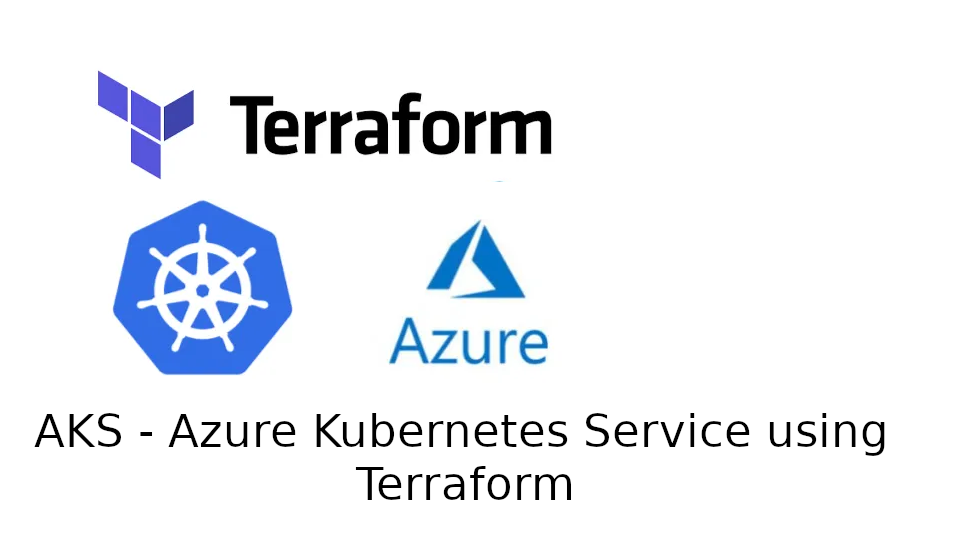

     

# AKS Cluster
## Table of Contents:
1. [A description of the project](#a-description-of-the-project)
2. [Usage instructions](#usage-instructions)
3. [File structure of the project](#file-structure-of-the-project)
4. [License information ](#license-information)

## A description of the project: 
- What it does:
    - This project is a terraform implementation wherein there are 2 modules being utillised to facilitate the creation of an AKS cluster. It has a networking module, an aks cluster module and both are pulled together in the main.tf file of the parent directory.
    - A virtual network needed to be created to provide and isolated environemnt for applications 
    - AKS uses two subnets; one for the control plane and one for the worker nodes. 
        - The control plane subnet controls the worker nodes and the applications they use. 
        - The worker nodes subnet manages the virtual machines where the customer applications will be deployed into.
    - Uses IaC (Infrastructure as Code) so as to allow future developers to return to desired specification configurations stored as code, decreases risk of manually deploying repeat code and humans making mistakes, stronger security with faster recovery, faster deployment, improved accountability, increased operational efficiency with shorter development lifecycles and more financial savings because of all this.
- The aim of the project:
    - To understand the necessary steps to take to create an AKS cluster using Terraform.
- What you learned:
    - How to provision resources for Terraform
    - How to construct and utilise modules in Terraform
    - How to use variables
    - How to add sensitive variables into Terraform scripts without revealing the data
    - How to access AKS cluster services using `kubectl` commands on the AzureCLI
    - How to access the kubeconfig data from an AKS cluster once its been applied using `terraform apply`
    - Why IaC (Infrastructure as Code) is beneficial to businesses and other developers in general.
    How to set up a VNet using terraform and why CIDR blocks are necessary for setting up network space.

## Usage instructions
- Once the repository has been cloned onto the local machine, the user will need to create a `secrets.tfvars` file. Replace the values in the quotation marks with the actual credentials as these will be needed later. In this file will need to be stored these values:
    - client_id        = "your_azure_client_id"
    - client_secret    = "your_azure_client_secret"
    - subscription_id  = "your_azure_subscription_id"
    - tenant_id        = "your_azure_tenant_id"
    - public_ip        = "your_public_ip_address"
- Now initialise terraform in each directory and subdirectory:
    - Change directory into the `networking-module` and run `terraform init` from the command line.
    - Change directory back to `AKS-TERRAFORM` directory and then into `aks-cluster-module` and run `terraform init` 
    - change back into `AKS-TERRAFORM` and run `terraform init`
- Once everything is initialised, from the `AKS-TERRAFORM` directory, run `terraform apply -var-file="secrets.tfvars"` to apply the terraform configuration with the sensitive data variables.
- To access control of the cluster, login to azure with `az login`
- Then run `az aks get-credentials --resource-group <your-resource-group> --name <your-aks-cluster-name>`, replacing `<your-resource-group>` and `<your-aks-cluster-name>` with the appropriate details.
- It is now possible to use `kubectl` commands to control your cluster from the CLI. Try it with `kubectl config get-contexts` or `kubectl describe nodes`.

## File structure of the project
- AKS-TERRAFORM
    - main.tf
    - variables.tf
    - aks-cluster-module
        - main.tf:
        - variables.tf
        - outputs.tf
    - networking-module
        - main.tf
        - variables.tf
        - outputs.tf
    - logo.png
    - definitions.md
    - README.md
            

## License information 
##### __Copyright Karlos Moodios. All rights reserved.__